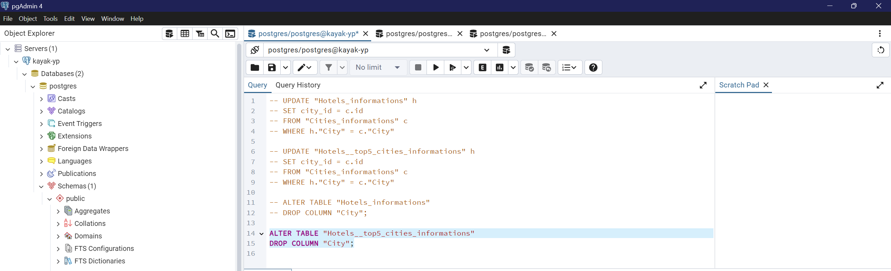

# Kayak Project

[](http://forthebadge.com) [](https://forthebadge.com)

This is the data management project. The goal is to use scraping to get hotels' data from booking.com and to use API to get localisation and weather information for the following cities.
```python 
["Mont Saint Michel","St Malo","Bayeux","Le Havre","Rouen","Paris","Amiens","Lille","Strasbourg","Chateau du Haut Koenigsbourg","Colmar","Eguisheim","Besancon","Dijon","Annecy","Grenoble","Lyon","Gorges du Verdon",
"Bormes les Mimosas","Cassis","Marseille","Aix en Provence","Avignon","Uzes","Nimes","Aigues Mortes","Saintes Maries de la mer","Collioure","Carcassonne","Ariege","Toulouse","Montauban","Biarritz","Bayonne","La Rochelle"]
```
After that we needed to display a map of top 5 cities and top 20 hotels in function of the previous data informations. Moreover we used `SQLAlchemy` and AWS RDS to put these data in a database that has been structured.

## Getting Started

All the work and tests are in this [Notebook](Project_kayak_YP.ipynb).
* Part 1 - Get the weather and localisation with API
* Part 2 - Get the hotels infos with the web scraping
* Part 3 - Work on the dataset and put it on S3
* Part 4 - ETL, create a database and put the cleaned and reworked data on it


### Prerequisites

Things you need to run the codes:

```
python 3.12.1

pandas 
numpy
matplotlib
plotly
plotly.express
plotly.graph_objects
scrapy
sqlalchemy
```

### Running Tests

Here some example of results:

* *Maps*:


* *Scraping proof*:
  


* *S3 bucket with csv files*:
  


* *Database RDS*:
 


**Cleaning and ordoning the data:**



**Table of the database for the hotels in the top 5 cities:**


### ✅ All works, we can do sql requests on the database for each table : 
* Cities information with coordinates, weather and id
* All the hotels informations for each 35 cities
* Hotels informations for the top 5 of cities in function of the temperature

## Acknowledgments

* Thanks for Jedha and its instructors for the lectures, exercises and all the work.

